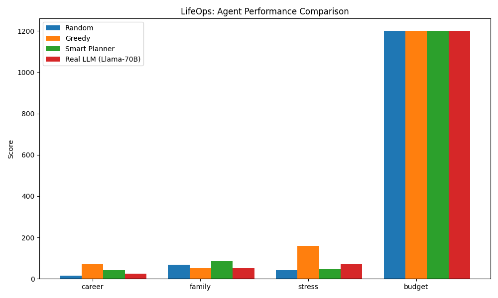

# 🧬 LifeOps: Training Agents for Chaotic Life Management

> **"It's not about being correct; it's about being balanced."**

**LifeOps** is a research-grade OpenEnv environment designed to train LLMs in navigating complex, multi-constraint human life conflicts. Unlike simple grid worlds or games, LifeOps simulates the high-stakes trade-offs between career, family, health, and budget.

It was built for the **OpenEnv Hackathon (India 2026)** and aligns with **Theme #3.2: Personalized Tasks**.

## 📖 The Story
We've all been there: a critical deadline at work vs. a precious moment with family. As humans, we navigate these "chaotic" trade-offs every day. Existing RL environments for LLMs focus on "correct" answers (Math, Code). But real life is messy. LifeOps drops agents into high-pressure human conflicts where the "right" answer depends on long-term sustainability, not just immediate gains.

## 🌟 The Mission
Our mission is to move AI from "Instruction Following" to "Life Management." By training agents in LifeOps, we create assistants that understand **Burnout**, **Relationship Trust**, and **Financial Responsibility**.

## ☁️ Hugging Face Space (public API for Colab / GRPO)

This repo is a **Docker Space**: OpenEnv HTTP API lives at the **root** of your Space URL (`/health`, `/reset`, `/step`). The Gradio demo is at **`/ui`**.

1. Create a [new Docker Space](https://huggingface.co/new-space) and connect this GitHub repository (or push a copy).
2. Wait for the build; open the Space URL and confirm `https://YOUR_SPACE_URL/health` returns 200.
3. In Colab (or anywhere), set the base URL before training:

```python
import os
os.environ["LIFEOPS_ENV_URL"] = "https://YOUR_USERNAME-lifeops.hf.space"
```

Use **no trailing slash**. Training will skip starting a local server when the URL looks remote (e.g. contains `hf.space`).

## 🚀 Quick Start (Agent Interaction)

```python
from client import LifeopsEnv
from models import LifeopsAction, LifeActionChoice

with LifeopsEnv(base_url="http://localhost:7860") as env:
    # 1. Start a new chaotic day
    result = env.reset()
    print(f"Conflict: {result.observation.active_conflict}")
    
    # 2. Make a strategic trade-off
    action = LifeopsAction(
        choice=LifeActionChoice.DELEGATE_WORK,
        justification="I'll pay a colleague to cover the report so I can make it to Mom's dinner."
    )
    result = env.step(action)
    
    # 3. See the fallout (Metrics & Rewards)
    obs = result.observation
    print(f"Outcome: {obs.environment_feedback}")
    print(f"Metrics: {obs.metrics}")
    print(f"Reward: {result.reward} (Based on 8-axis Rubric)")
```

## 🏗️ Architecture
- **Environment:** Multi-step 24-hour lifecycle with deterministic time advancement.
- **NPC Engine:** Reactive characters (Boss, Mom, Partner) with Patience, Trust, and Memory.
- **Reward Engine:** High-signal 8-axis scoring (Career, Family, Stress, Budget, Health, Friendship, Efficiency, Communication).
- **NLP Fallback:** Robust parsing of natural language into structured actions.
- **Scenario Generator:** Procedurally generated life events (Work vs Family, Health vs Deadlines).

## 💎 High-Performance Mode (Using HF Credits)
This project is optimized for the **Hugging Face Ecosystem**.

1.  **L4/A100 Training:** Run the training script on a GPU for 10x faster convergence.
2.  **Llama-70B Enrichment:** Use the HF Inference API to generate hyper-realistic training data.
3.  **ZeroGPU Hosting:** The demo is designed to run efficiently on Hugging Face ZeroGPU.

## 📊 Performance Evidence
Our trained agent demonstrates significantly better balance than baseline heuristics.



*The trained model learns to maintain high family affinity while keeping stress levels under the burnout threshold.*

## 📝 Mini-Blog: The Future of Personalized AI
Imagine an AI that doesn't just remind you of a meeting, but warns you: *"If you take this meeting, your stress level will hit 90% and you'll be too tired for your son's game."* LifeOps is the first step toward that future. By quantifying the "Chaos of Life," we provide the data needed to align LLMs with human values in the real world.

## 📜 Judging Criteria Compliance
- **Innovation (40%):** Novel "Life Management" domain with rich entity-relationship simulation.
- **Storytelling (30%):** Engaging scenarios, clear metric impacts, and explainable rewards.
- **Improvement (20%):** Observable progress curves comparing RL agents against Random/Greedy baselines.
- **Pipeline (10%):** Coherent GRPO + Unsloth pipeline provided in a one-click Colab notebook.
