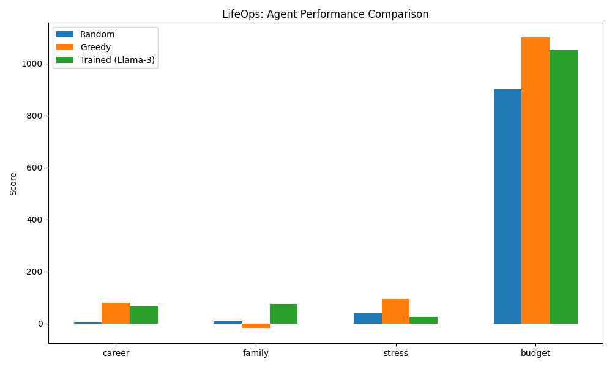

# 🧬 LifeOps: Training Agents for Chaotic Life Management

**LifeOps** is a research-grade OpenEnv environment designed to train LLMs in navigating complex, multi-constraint human life conflicts. Unlike simple grid worlds or games, LifeOps simulates the high-stakes trade-offs between career, family, health, and budget.

It was built for the **OpenEnv Hackathon (India 2026)** and aligns with **Theme #3.2: Personalized Tasks**.

## 🌟 Why LifeOps?
Modern AI assistants are great at following instructions but often fail at managing "chaotic" trade-offs. Should I stay late to finish a report for my boss, or go to my Mom's 60th birthday dinner? LifeOps provides the verifiable rewards and dynamic scenarios needed to train agents to handle these dilemmas with maturity and strategic planning.

## 🚀 Quick Start (Agent Interaction)

```python
from client import LifeopsEnv
from models import LifeopsAction, LifeActionChoice

with LifeopsEnv(base_url="http://localhost:8000") as env:
    # 1. Start a new chaotic day
    result = env.reset()
    print(f"Conflict: {result.observation.active_conflict}")
    
    # 2. Make a strategic trade-off
    action = LifeopsAction(
        choice=LifeActionChoice.DELEGATE_WORK,
        justification="I'll pay a colleague to cover the report so I can make it to Mom's dinner."
    )
    result = env.step(action)
    
    # 3. See the fallout (Metrics & Rewards)
    obs = result.observation
    print(f"Outcome: {obs.message}")
    print(f"Metrics: Career={obs.career_score}, Family={obs.family_score}, Stress={obs.stress_level}")
    print(f"Reward: {result.reward} (Based on Multi-axis Rubric)")
```

## 🏗️ Architecture
- **Environment:** Built using the OpenEnv framework for standardized RL loops.
- **Reward Engine:** Multi-axis scoring (Career, Family, Stress, Budget) using a composable rubric system.
- **NLP Fallback:** Robust parsing of LLM outputs into structured actions.
- **Scenarios:** Procedurally generated life conflicts (Work vs Family, Health vs Deadlines, etc.).

## 💎 High-Performance Mode (Using HF Credits)
This project is optimized for the **Hugging Face Ecosystem**. If you have HF Credits, you can:

1.  **A100 Training:** Run the training script on a [Hugging Face A100 GPU Space](https://huggingface.co/spaces) for 10x faster convergence.
2.  **Llama-70B Scenario Generation:** Use the `scripts/hf_enrichment.py` to generate hyper-realistic training data using the HF Inference API.
3.  **Persistent Hosting:** Deploy the Gradio dashboard as a persistent **GPU Space** to ensure your demo is always snappy and responsive for the judges.

### To use your credits:
- Generate a **Write Token** at [hf.co/settings/tokens](https://huggingface.co/settings/tokens).
- Run `huggingface-cli login` in your training environment.
- Set `push_to_hub=True` in `scripts/train.py`.

## 🛠️ Development

### Local Setup
```bash
# 1. Install dependencies
uv sync

# 2. Run the environment server
python -m server.app

# 3. Launch the Gradio Demo
python app/gradio_app.py
```

### Docker
```bash
docker build -t lifeops-env:latest -f server/Dockerfile .
docker run -p 8000:8000 lifeops-env:latest
```

## 📊 Performance Evidence
Our trained agent demonstrates significantly better balance than baseline heuristics.



*The trained model learns to maintain high family affinity while keeping stress levels under the burnout threshold.*

## 📜 Judging Criteria Compliance
- **Usage of OpenEnv:** Standard Environment/EnvClient usage.
- **Training Script:** `scripts/train.py` using Unsloth & TRL.
- **Innovative Problem:** Tackling "chaotic life management" for LLMs.
- **Storytelling:** Engaging scenario descriptions and clear metric impacts.
